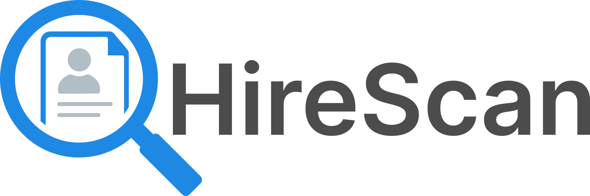

# HireScan Prompt

Este prompt ha sido diseñado para proporcionar una evaluación experta, estructurada y personalizada de currículums vitae. Facilita la identificación de fortalezas, áreas de mejora y el nivel de adecuación frente a ofertas laborales específicas. Su enfoque integral permite optimizar el CV para diversos contextos de postulación, maximizando así las oportunidades del candidato.

Actualmente, existen implementaciones funcionales de este prompt en ChatGPT, como **[HireScan GPT](https://chatgpt.com/g/g-6810df0185408191aaba78a47152f5e0-hirescan)**. Estas herramientas permiten a los usuarios aprovechar las capacidades del prompt de forma inmediata, sin configuraciones adicionales. Solo necesitas subir tu CV y las ofertas laborales en formato PDF o como capturas, y en pocos minutos obtendrás resultados personalizados y prácticos.

## Beneficios de Utilizar Este Prompt

- Proporciona una evaluación profesional y detallada de los CVs, asegurando que cumplan con los elementos clave de calidad.
- Analiza tanto habilidades técnicas como blandas, incluyendo el potencial de liderazgo.
- Entrega recomendaciones claras y personalizadas para mejorar el CV.
- Permite comparar el perfil del candidato con ofertas laborales específicas, generando un "match" y una recomendación sobre la postulación.
- Considera el contexto de postulación (empresas pequeñas vs. grandes y sistemas ATS), orientando la adaptación del CV.
- Ayuda a identificar brechas de conocimientos relevantes para la vacante, promoviendo la mejora continua del perfil profesional.

## Implementaciones

- **[HireScan GPT](https://chatgpt.com/g/g-6810df0185408191aaba78a47152f5e0-hirescan)**: es una implementación que soporta español y funciona de manera gratuita con el plan Free de ChatGPT. No requiere configurar nada, solo sube el PDF o captura de tus CV y ofertas laborales.

## Usar Este Prompt

Para utilizar este prompt, sigue estos pasos:

1. Abre el archivo [`./hirescan.prompt.md`](./hirescan.prompt.md) en este repositorio.
2. Copia el contenido completo del prompt.
3. Pega el contenido copiado en las instrucciones del agente de inteligencia artificial que estés utilizando.

Este proceso asegura que el agente pueda interpretar y aplicar correctamente el prompt para ofrecer los mejores resultados.  

## Contribuciones

¡Las contribuciones son bienvenidas! Si deseas colaborar con este proyecto, puedes hacerlo de las siguientes maneras:

- Haz un fork del repositorio y realiza las modificaciones que consideres necesarias en el prompt.
- Envía tus mejoras o nuevas ideas a través de un pull request.
- Reporta problemas o sugiere nuevas funcionalidades creando un [issue](https://github.com/JonDotsoy/hirescan/issues/new).

Este proyecto está abierto a desarrolladores interesados en mejorar la experiencia de los usuarios. ¡Tu participación es valiosa y apreciada!

## Código de Conducta

Este proyecto promueve un ambiente inclusivo, seguro y libre de acoso para todos los participantes, sin distinción de género, raza, orientación sexual, capacidades, apariencia física o creencias. No se tolera ningún tipo de acoso, y cualquier conducta inapropiada será sancionada. Si eres víctima o testigo de acoso, contacta a la organización de inmediato. Consulta el archivo [CODE_OF_CONDUCT.md](./CODE_OF_CONDUCT.md) para más detalles.

## Licencia

Este proyecto está licenciado bajo los términos especificados en el archivo [LICENSE](./LICENSE). Por favor, revisa el archivo para más detalles.
